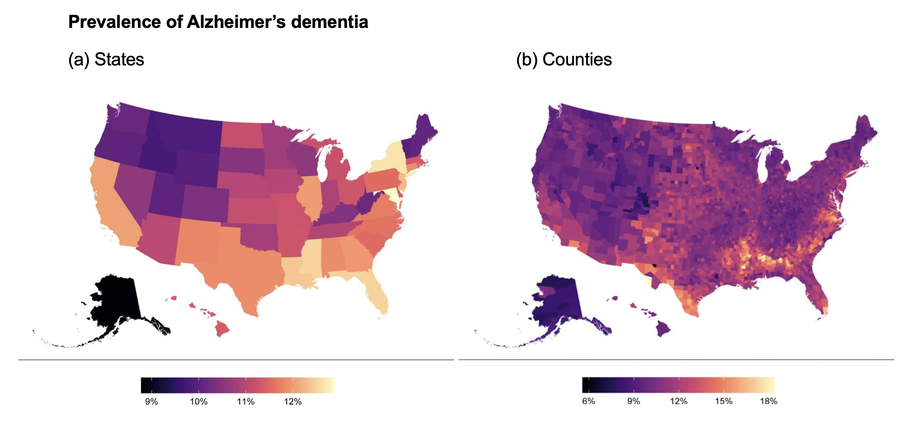
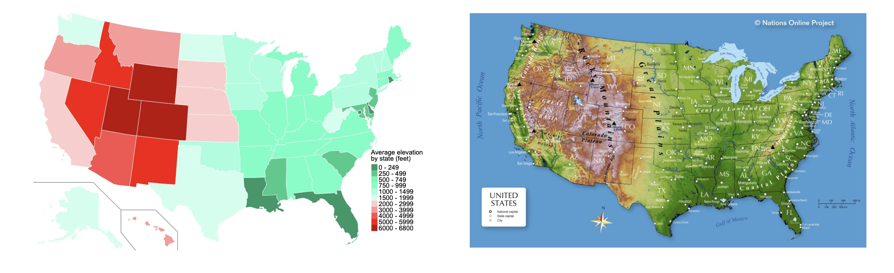

## Conclusion

This ecological study identified a positive association between Alzheimer’s dementia prevalence and socioeconomic disadvantage, as measured by the proportion of households receiving SNAP benefits. While causal inference is limited due to the aggregated nature of the data, the strong visual correspondence between geographic patterns and the moderate statistical association support this relationship.

Previous studies have reported links between socioeconomic status and dementia risk. For example, Powell et al. (2020) found that individuals residing in the most disadvantaged neighborhoods had significantly higher odds of Alzheimer’s neuropathology. Although that study was limited to two states, the present findings suggest that similar patterns may extend at the national level.

These results highlight the importance of considering broader social and environmental contexts in understanding Alzheimer’s disease risk and emphasize the need for equitable socioeconomic conditions to promote cognitive health.

## Summary

This study conducted an ecological analysis of Alzheimer’s dementia prevalence using multiple aggregated datasets. While prior work identified distinct geographic patterns at the county level, state-level SCD data did not reveal consistent patterns among the highest-prevalence states. Population-based factors, including total and senior population, were insufficient to explain the observed distribution.

In contrast, socioeconomic indicators—particularly SNAP participation—demonstrated strong spatial similarity and a moderate statistical association with AD prevalence. These findings support the hypothesis that socioeconomic disadvantage may be an important determinant of regional variation in Alzheimer’s disease.

## Further Discussion

### Elevation Effect

Environmental factors were not formally assessed in this study; however, visual comparison suggests a potential similarity between AD prevalence patterns and geographic elevation. Previous studies have reported associations between altitude and dementia-related outcomes, including Alzheimer’s disease mortality (Thielke et al., 2015).

The relationship between altitude and Alzheimer’s disease may be complex, involving both physiological stressors and long-term adaptation mechanisms. While this study does not establish a direct link, the observed spatial similarity warrants further investigation using appropriate environmental and epidemiological data.

In summary, future studies integrating socioeconomic, geographic and biological factors may provide a more comprehensive understanding of regional variation in Alzheimer’s disease risk.

(Left) US map with average elevation by state, [Source: wikipedia](https://en.wikipedia.org/wiki/List_of_U.S._states_and_territories_by_elevation)\

(Right) US topographic map, [Source: wikipedia](https://simple.wikipedia.org/wiki/List_of_U.S._states_by_elevation)
