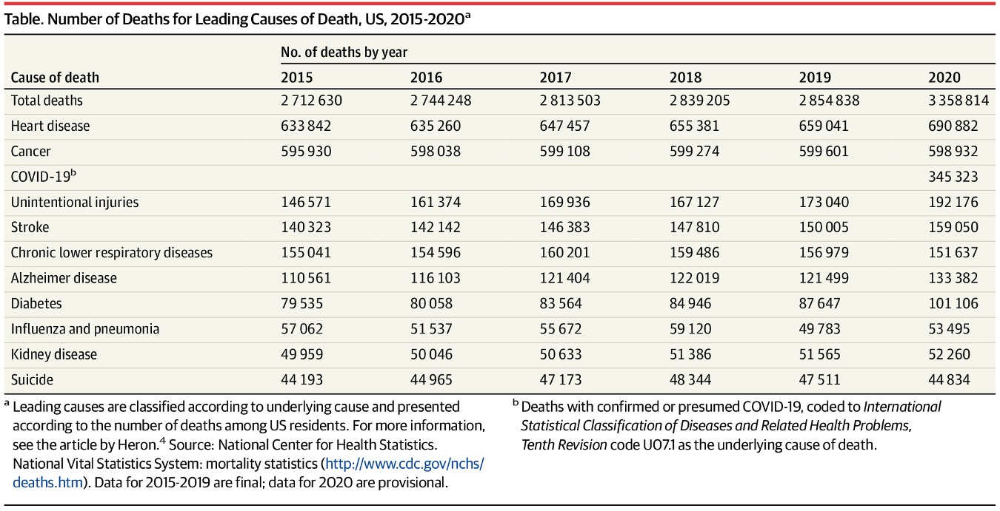

Alzheimer’s disease (AD) is a progressive neurodegenerative disorder and a leading cause of dementia worldwide. Aging is the strongest known risk factor, and recent studies have identified multiple senescence-related genetic pathways associated with disease development (Liu et al., 2024).

AD is also one of the leading causes of death in the United States (Figure I1) (Ahmad and Anderson, 2021). Although the categorization of causes of death in this table is debatable due to inconsistent disease hierarchies, the data clearly show that Alzheimer's disease (AD) alone is responsible for a significant number of deaths in the United States.

Diagnosis of AD typically involves comprehensive clinical evaluation, including cognitive assessments and neuroimaging techniques such as amyloid PET scans. In 2023, Dhana et al. reported state-level prevalence of Alzheimer’s dementia across the United States based on their four neurocognitive tests and demographic data, identifying Maryland (12.9%), New York (12.7%), Mississippi (12.5%), and Florida (12.5%) as the highest-prevalence states (Figure I2), which are unlikely to have many state-level common characteristics. Interestingly, the county-level map reveals distinct region-specific patterns, two large curved formations, including a Y-shaped pattern in the Southeast and a C-shaped pattern in the central region, which were not fully described in the original paper.

Therefore, in this study, I analyze Behavioral Risk Factor Surveillance System (BRFSS) survey data to assess potential risk factors shared in the four high AD prevalence states and U.S. Census data to investigate potential demographic and socioeconomic factors related to the region-specific pattern in the Alzheimer’s dementia prevalence. Specifically, I examine subjective cognitive decline (SCD) from BRFSS survey data as an indicator for early cognitive impairment and compare patterns in high-prevalence states (Maryland, New York, Mississippi, and Florida) to national trends. Additionally, county-level demographic and housing characteristics were analyzed to explore potential socioeconomic AD risk factors to explain the region-specific pattern on the visualized map of AD prevalence. Surprisingly, I observed an unexpected relationship between Alzheimer’s dementia prevalence and the proportion of households receiving "Food Stamps/ Supplemental Nutrition Assistance Program (SNAP)" benefits, suggesting the need for further investigation into socioeconomic determinants of cognitive health. As global life expectancy continues to rise, identifying modifiable risk factors for AD is critical to improving quality of life and alleviating the societal burden of the disease. Ultimately, this ecological study serves as a foundation step in generating robust hypotheses regarding the socioeconomic determinants of cognitive health.
